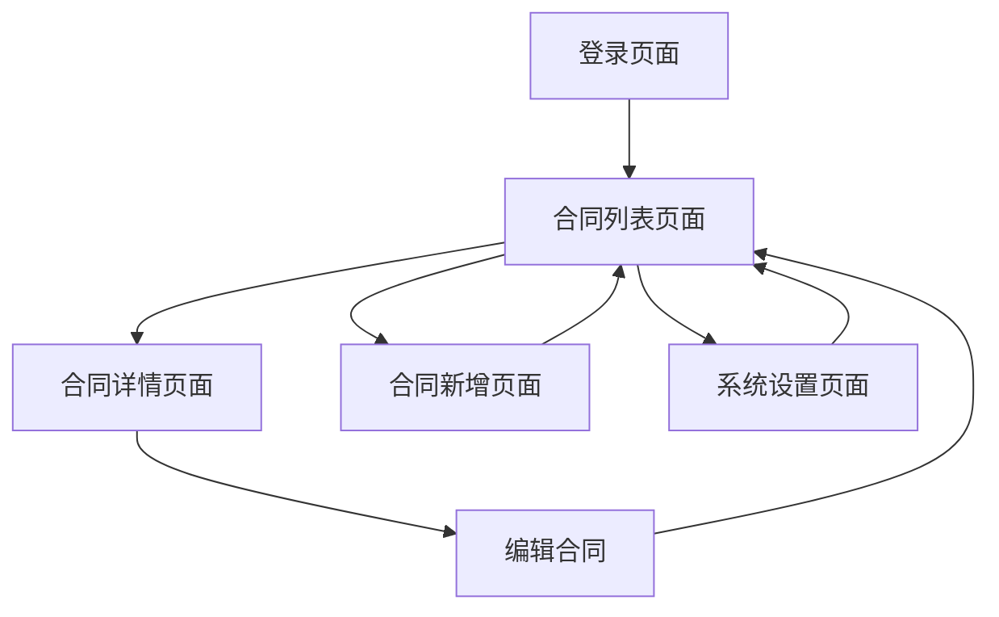

# 合同管理系统产品需求文档

## 1. 产品概述

合同管理系统是一个面向企业内部员工的合同信息管理平台，主要用于合同信息的采集、存储、管理和到期提醒。
- 解决企业合同管理分散、到期提醒不及时的问题，为企业员工提供统一的合同管理入口。
- 通过自动化的到期提醒机制，帮助企业避免合同逾期风险，提高合同管理效率。

## 2. 核心功能

### 2.1 用户角色

| 角色 | 注册方式 | 核心权限 |
|------|----------|----------|
| 普通员工 | 管理员分配账号 | 可查看和管理自己负责的合同，上传合同扫描件 |
| 管理员 | 系统预设账号 | 可管理所有合同，配置系统参数，管理用户账号 |

### 2.2 功能模块

我们的合同管理系统包含以下主要页面：
1. **登录页面**：用户身份验证，系统访问入口。
2. **合同列表页面**：合同信息展示，搜索筛选，状态管理。
3. **合同详情页面**：合同详细信息查看，扫描件预览，编辑功能。
4. **合同新增页面**：合同信息录入，扫描件上传。
5. **系统设置页面**：提醒天数配置，用户管理。

### 2.3 页面详情

| 页面名称 | 模块名称 | 功能描述 |
|----------|----------|----------|
| 登录页面 | 用户认证 | 验证用户名密码，记住登录状态，跳转到主页面 |
| 合同列表页面 | 合同展示模块 | 分页显示合同列表，支持按合同名称、负责人、状态筛选 |
| 合同列表页面 | 状态管理模块 | 显示合同状态（正常、即将到期、已到期），状态颜色区分 |
| 合同详情页面 | 信息展示模块 | 显示合同完整信息，包括基本信息、截止日期、负责人等 |
| 合同详情页面 | 文件管理模块 | 上传、预览、下载合同扫描件，支持PDF、图片格式 |
| 合同详情页面 | 编辑功能模块 | 修改合同信息，更新截止日期，变更负责人 |
| 合同新增页面 | 信息录入模块 | 录入合同基本信息（名称、类型、截止日期、负责人等） |
| 合同新增页面 | 文件上传模块 | 上传合同扫描件，文件格式验证，大小限制 |
| 系统设置页面 | 参数配置模块 | 设置提醒天数，配置邮件服务器信息 |
| 系统设置页面 | 用户管理模块 | 添加、删除、修改用户账号，分配权限 |

## 3. 核心流程

**普通员工操作流程：**
用户登录系统 → 查看合同列表 → 选择合同查看详情或新增合同 → 录入合同信息并上传扫描件 → 保存合同信息

**管理员操作流程：**
管理员登录 → 系统设置配置提醒参数 → 管理用户账号 → 查看所有合同状态 → 处理到期合同

**系统自动提醒流程：**
系统定时检查合同截止日期 → 计算距离截止日期天数 → 匹配提醒设置 → 发送邮件给合同负责人

## 4. 用户界面设计

### 4.1 设计风格

- **主色调**：蓝色系（#1890FF）作为主色，灰色系（#F5F5F5）作为背景色
- **按钮样式**：圆角矩形按钮，主要操作使用蓝色，次要操作使用灰色边框
- **字体**：系统默认字体，标题使用16px，正文使用14px，辅助信息使用12px
- **布局风格**：卡片式布局，顶部导航栏，左侧菜单（管理员），内容区域居中
- **图标风格**：使用简洁的线性图标，统一的视觉风格

### 4.2 页面设计概览

| 页面名称 | 模块名称 | UI元素 |
|----------|----------|--------|
| 登录页面 | 登录表单 | 居中卡片布局，用户名密码输入框，蓝色登录按钮，简洁的背景 |
| 合同列表页面 | 导航栏 | 顶部蓝色导航栏，显示系统名称，用户信息，退出按钮 |
| 合同列表页面 | 筛选区域 | 搜索框，状态下拉选择，日期范围选择器，查询按钮 |
| 合同列表页面 | 数据表格 | 表格显示合同信息，状态用颜色标识，操作按钮右对齐 |
| 合同详情页面 | 信息展示 | 卡片式布局展示合同详细信息，字段标签左对齐 |
| 合同详情页面 | 文件预览 | 文件列表展示，预览按钮，下载链接，上传区域 |
| 合同新增页面 | 表单区域 | 表单字段垂直排列，必填项标红星，提交按钮居中 |
| 系统设置页面 | 配置面板 | 选项卡切换，配置项分组显示，保存按钮固定底部 |

### 4.3 响应式设计

系统采用桌面优先的设计方案，主要面向PC端用户使用，同时考虑平板设备的适配，暂不考虑手机端的触摸优化。