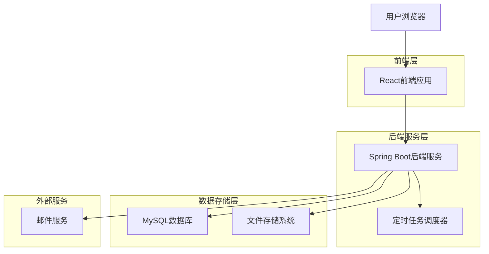
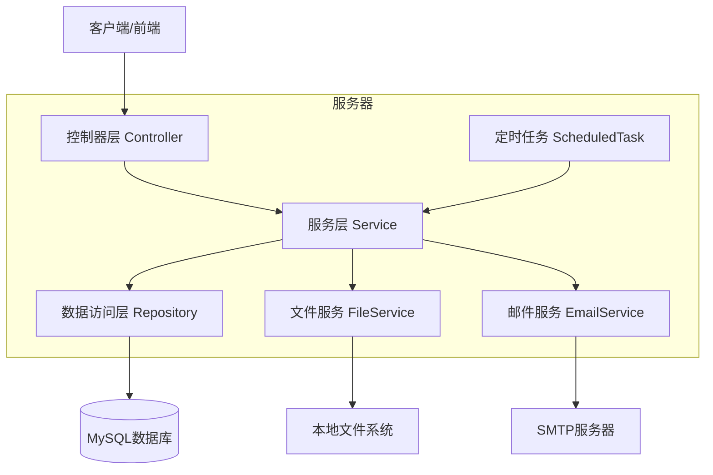
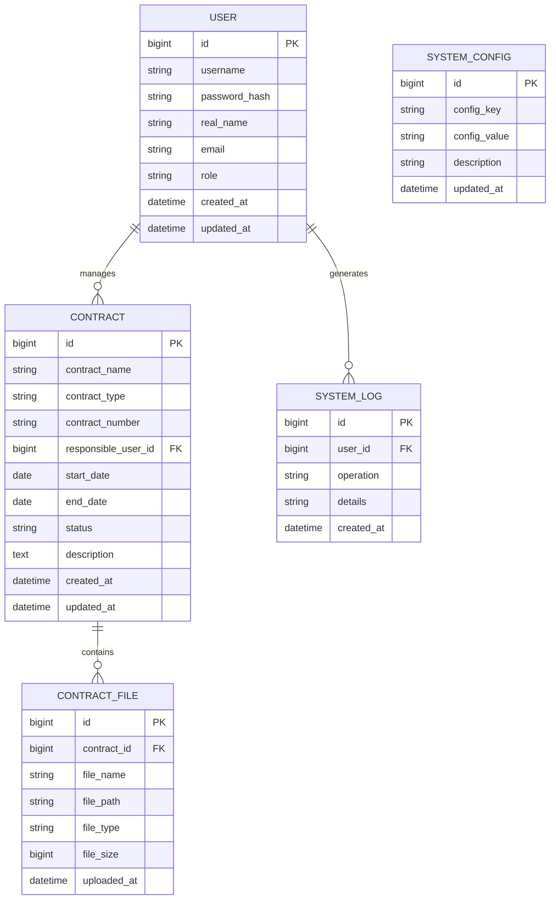

# 合同管理系统技术架构文档

## 1. 架构设计



## 2. 技术描述

* 前端：React\@18 + Ant Design\@5 + Vite

* 后端：Spring Boot\@3.2 + Spring Security + Spring Data JPA

* 数据库：MySQL\@8.0

* 文件存储：本地文件系统

* 邮件服务：Spring Boot Mail

* 定时任务：Spring Boot Scheduler

## 3. 路由定义

| 路由             | 用途                 |
| -------------- | ------------------ |
| /login         | 登录页面，用户身份验证        |
| /dashboard     | 仪表板页面，显示合同概览和待处理事项 |
| /contracts     | 合同列表页面，显示和管理合同信息   |
| /contracts/new | 新增合同页面，录入合同信息和上传文件 |
| /contracts/:id | 合同详情页面，查看和编辑具体合同   |
| /settings      | 系统设置页面，配置提醒参数和用户管理 |

## 4. API定义

### 4.1 核心API

**用户认证相关**

```
POST /api/auth/login
```

请求参数：

| 参数名      | 参数类型   | 是否必填 | 描述  |
| -------- | ------ | ---- | --- |
| username | string | true | 用户名 |
| password | string | true | 密码  |

响应参数：

| 参数名      | 参数类型    | 描述      |
| -------- | ------- | ------- |
| success  | boolean | 登录是否成功  |
| token    | string  | JWT认证令牌 |
| userInfo | object  | 用户基本信息  |

示例：

```json
{
  "username": "admin",
  "password": "123456"
}
```

**合同管理相关**

```
GET /api/contracts
POST /api/contracts
GET /api/contracts/{id}
PUT /api/contracts/{id}
DELETE /api/contracts/{id}
```

**文件上传相关**

```
POST /api/files/upload
GET /api/files/{fileId}
```

**系统配置相关**

```
GET /api/settings
PUT /api/settings
```

## 5. 服务器架构图



## 6. 数据模型

### 6.1 数据模型定义



### 6.2 数据定义语言

**用户表 (users)**

```sql
-- 创建用户表
CREATE TABLE users (
    id BIGINT PRIMARY KEY AUTO_INCREMENT,
    username VARCHAR(50) UNIQUE NOT NULL COMMENT '用户名',
    password_hash VARCHAR(255) NOT NULL COMMENT '密码哈希',
    real_name VARCHAR(100) NOT NULL COMMENT '真实姓名',
    email VARCHAR(100) NOT NULL COMMENT '邮箱地址',
    role VARCHAR(20) DEFAULT 'USER' COMMENT '用户角色：ADMIN/USER',
    created_at DATETIME DEFAULT CURRENT_TIMESTAMP COMMENT '创建时间',
    updated_at DATETIME DEFAULT CURRENT_TIMESTAMP ON UPDATE CURRENT_TIMESTAMP COMMENT '更新时间'
);

-- 创建索引
CREATE INDEX idx_users_username ON users(username);
CREATE INDEX idx_users_email ON users(email);

-- 初始化管理员账号
INSERT INTO users (username, password_hash, real_name, email, role) 
VALUES ('admin', '$2a$10$N.zmdr9k7uOCQb376NoUnuTJ8iAt6Z5EHsM8lE9lBOsl7iKTVEFDa', '系统管理员', 'admin@company.com', 'ADMIN');
```

**合同表 (contracts)**

```sql
-- 创建合同表
CREATE TABLE contracts (
    id BIGINT PRIMARY KEY AUTO_INCREMENT,
    contract_name VARCHAR(200) NOT NULL COMMENT '合同名称',
    contract_type VARCHAR(50) NOT NULL COMMENT '合同类型',
    contract_number VARCHAR(100) UNIQUE COMMENT '合同编号',
    responsible_user_id BIGINT NOT NULL COMMENT '负责人ID',
    start_date DATE NOT NULL COMMENT '合同开始日期',
    end_date DATE NOT NULL COMMENT '合同截止日期',
    status VARCHAR(20) DEFAULT 'ACTIVE' COMMENT '合同状态：ACTIVE/EXPIRED/TERMINATED',
    description TEXT COMMENT '合同描述',
    created_at DATETIME DEFAULT CURRENT_TIMESTAMP COMMENT '创建时间',
    updated_at DATETIME DEFAULT CURRENT_TIMESTAMP ON UPDATE CURRENT_TIMESTAMP COMMENT '更新时间',
    INDEX idx_contracts_responsible_user(responsible_user_id),
    INDEX idx_contracts_end_date(end_date),
    INDEX idx_contracts_status(status)
);
```

**合同文件表 (contract\_files)**

```sql
-- 创建合同文件表
CREATE TABLE contract_files (
    id BIGINT PRIMARY KEY AUTO_INCREMENT,
    contract_id BIGINT NOT NULL COMMENT '合同ID',
    file_name VARCHAR(255) NOT NULL COMMENT '文件名',
    file_path VARCHAR(500) NOT NULL COMMENT '文件路径',
    file_type VARCHAR(50) NOT NULL COMMENT '文件类型',
    file_size BIGINT NOT NULL COMMENT '文件大小（字节）',
    uploaded_at DATETIME DEFAULT CURRENT_TIMESTAMP COMMENT '上传时间',
    INDEX idx_contract_files_contract_id(contract_id)
);
```

**系统配置表 (system\_config)**

```sql
-- 创建系统配置表
CREATE TABLE system_config (
    id BIGINT PRIMARY KEY AUTO_INCREMENT,
    config_key VARCHAR(100) UNIQUE NOT NULL COMMENT '配置键',
    config_value VARCHAR(500) NOT NULL COMMENT '配置值',
    description VARCHAR(200) COMMENT '配置描述',
    updated_at DATETIME DEFAULT CURRENT_TIMESTAMP ON UPDATE CURRENT_TIMESTAMP COMMENT '更新时间'
);

-- 初始化系统配置
INSERT INTO system_config (config_key, config_value, description) VALUES 
('email.reminder.days', '30,15,7,3', '合同到期提醒天数（逗号分隔）'),
('email.smtp.host', 'smtp.company.com', 'SMTP服务器地址'),
('email.smtp.port', '587', 'SMTP服务器端口'),
('file.upload.path', '/data/contract-files/', '文件上传路径'),
('file.max.size', '10485760', '文件最大大小（10MB）');
```

**系统日志表 (system\_logs)**

```sql
-- 创建系统日志表
CREATE TABLE system_logs (
    id BIGINT PRIMARY KEY AUTO_INCREMENT,
    user_id BIGINT COMMENT '操作用户ID',
    operation VARCHAR(100) NOT NULL COMMENT '操作类型',
    details TEXT COMMENT '操作详情',
    created_at DATETIME DEFAULT CURRENT_TIMESTAMP COMMENT '操作时间',
    INDEX idx_system_logs_user_id(user_id),
    INDEX idx_system_logs_created_at(created_at)
);
```

